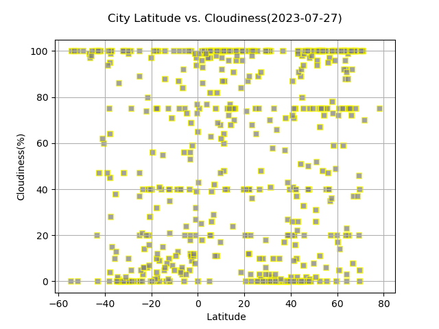
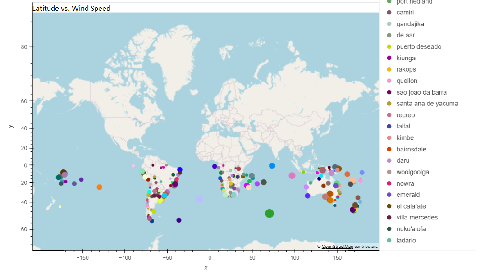

# python-api-challenge

In the previous project, we learned how to use matplotlib to include a statistics summary and to draw charts and plots for better reading and analysis📊. 
Now, we will see how to use IPAs to get a dynamic dataset and use our skills to analyze our data.
In this project, we will see in the first part what the weather is like as we approach the equator, and in the second part how to plan future vacations using weather data skills.


## What we will learn from this project:

- How to generate the Cities List by Using the citipy Library
  
- How to use the OpenWeatherMap API to retrieve weather data from the cities list generated
  
- How Use the OpenWeatherMap API to retrieve weather data from the cities list generated in the started code
  
- How to use our skill to create Plots to showcase the relationship between weather variables and Latitude: Latitude vs. Temperature, Latitude vs. Humidity, Latitude vs. Cloudiness, and Latitude vs. Wind Speed.
  
- How to use our skills to compute Linear Regression for each relationship: Latitude vs. Temperature in Northern and Southern Hemisphere, Latitude vs. Humidity in Northern and Southern Hemisphere,
  Latitude vs. Cloudiness in Northern and Southern Hemisphere, and Latitude vs. Wind Speed in Northern and Southern Hemisphere.  We will include the linear regression line, the model's formula, and the rvalues.
  
- How to create a map that displays a point for every city of our data using a characteristic of the weather
  
- How to narrow down our data to find our ideal weather condition
  
- How to use the Geoapify API to find hotels (or any other location)
  
- How to add the hotel name and the country as additional information in the hover message for each city in the map
  
## Instructions:

- Prepare the data

- Retrieve weather data

- Create Plots

- Compute Linear Regression Plots

- Create Maps

## Program:

### Tools:

- Pandas: it is a Python library for data manipulation and analysis

- Matplotlib.pyplot:  Matplotlib has a module named pyplot which makes things easy for plotting by providing features to control line styles, font properties, formatting axes etc. Matplotlib is a python library used to 
create 2D graphs and plots by using Python scripts.

- Scipy.stats: it is a module that contains a large number of probability distributions.

- Jupyter Notebook: it is a web-based interactive computing platform that allows the user to compile all aspects of a data project.
  
- Numpy: it is a Python library for working with arrays, in domain of linear algebra, fourier transform, and matrices.
  
- Requests: it is a module allowing the sending of HTTP requests using Python.

-  Hvplot: it provides a high-level plotting API built on HoloViews that provides a general and consistent API for plotting data.
  
- OpenWeatherMap: it is an online service that provides global weather data via API.
  
- Citipy: it is a Python library.

### Code 
#### Generate the Cities List by Using the citipy Library
```
# Empty list for holding the latitude and longitude combinations
lat_lngs = []

# Empty list for holding the cities names
cities = []

# Range of latitudes and longitudes
lat_range = (-90, 90)
lng_range = (-180, 180)

# Create a set of random lat and lng combinations
lats = np.random.uniform(lat_range[0], lat_range[1], size=1500)
lngs = np.random.uniform(lng_range[0], lng_range[1], size=1500)
lat_lngs = zip(lats, lngs)

# Identify nearest city for each lat, lng combination
for lat_lng in lat_lngs:
    city = citipy.nearest_city(lat_lng[0], lat_lng[1]).city_name
    # If the city is unique, then add it to a our cities list
    if city not in cities:
        cities.append(city)

# Print the city count to confirm sufficient count
print(f"Number of cities in the list: {len(cities)}")
```
plt.legend('Mouse ID', loc='upper right', frameon=True)


#### Use the OpenWeatherMap API to retrieve weather data from the cities list
```
# Set the API base URL

api_key = weather_api_key

url  =f'http://api.openweathermap.org/data/2.5/weather?appid={api_key}&units=metric&q='

# Define an empty list to fetch the weather data for each city
city_data = []

# Print to logger
print("Beginning Data Retrieval     ")
print("-----------------------------")

# Create counters
record_count = 1
set_count = 1

# Loop through all the cities in our list to fetch weather data
for i, city in enumerate(cities):
        
    # Group cities in sets of 50 for logging purposes
    if (i % 50 == 0 and i >= 50):
        set_count += 1
        record_count = 0
    # Create endpoint URL with each city
    city_url = url+city

   
    # Log the url, record, and set numbers
    print("Processing Record %s of Set %s | %s" % (record_count, set_count, city))

    # Add 1 to the record count
    record_count += 1

    # Run an API request for each of the cities
    try:
        # Parse the JSON and retrieve data
        city_weather= requests.get(city_url).json()

        # Parse out latitude, longitude, max temp, humidity, cloudiness, wind speed, country, and date

        city_lat = city_weather['coord']['lat']
        city_lng = city_weather['coord']['lon']
        city_max_temp = city_weather['main']['temp_max']
        city_humidity = city_weather['main']['humidity']
        city_clouds = city_weather['clouds']['all']
        city_wind =city_weather['wind']['speed']
        city_country = city_weather['sys']['country']
        city_date =city_weather['dt']

        # Append the City information into city_data list
        city_data.append({"City": city, 
                          "Lat": city_lat, 
                          "Lng": city_lng, 
                          "Max Temp": city_max_temp,
                          "Humidity": city_humidity,
                          "Cloudiness": city_clouds,
                          "Wind Speed": city_wind,
                          "Country": city_country,
                          "Date": city_date})

    # If an error is experienced, skip the city
    except:
        print("City not found. Skipping...")
        pass
              
# Indicate that Data Loading is complete 
print("-----------------------------")
print("Data Retrieval Complete      ")
print("-----------------------------")

```

#### Create the Scatter Plots: Example, Latitude vs. Temperature
```
# Build scatter plot for latitude vs. temperature
lat=city_data_df['Lat']
temp=city_data_df['Max Temp']
t= date.today()
plt.scatter(lat, temp, marker='o', facecolors='red', edgecolors='blue',alpha=1)
# Incorporate the other graph properties
plt.title( f'City Latitude vs. Max Temperature({t})\n')
plt.ylabel('Max Temperature (C)')
plt.xlabel(' Latitude')
# Save the figure
plt.savefig("output_data/Fig1.png")
# Show plot
plt.show()
```
#### Define a function to create Linear Regression plots
```
def regress_value(x_values, y_values,title,coordinats):
    r = scipy.stats.pearsonr(x_values, y_values)
    print(f"The r-value is: {r[0]}")
    (slope, intercept, rvalue, pvalue, stderr) = linregress(x_values, y_values)
    regress_values= x_values*slope+intercept
    line_eq='y='+str(round(slope,2))+'x+'+ str(round(intercept,2))
    plt.plot(x_values,regress_values,'green')
    plt.annotate(line_eq, coordinats,fontsize=15,color='red')
    plt.scatter(x_values, y_values, marker='o', facecolors='blue', edgecolors='gray',alpha=0.75)
    plt.ylabel(title)
    plt.xlabel('Latitude')
```

#### Compute Linear Regression for Each Relationship: Example, Temperature vs. Latitude Linear Regression Plot on Northern Hemisphere
```
# Create a DataFrame with the Southern Hemisphere data (Latitude < 0)
southern_hemi_df = city_data_df.loc[city_data_df['Lat']<0]
# Display sample data
southern_hemi_df.head()

```
### Results of the Scatter Plots

 
 
 
 

#### Create a map that displays a point for every city from our data. The size of the point should be the humidity in each city

```
%%capture --no-display
# Configure the map plot
map1 = city_data_df.hvplot.points(
    "Lng",
    "Lat",
    geo = True,
    tiles = "OSM",
    frame_width = 700,
    frame_height = 500,
    size = "Humidity",
    scale = 1,
    color = "City"
)
# Display the map
map1
```
#### Use the Geoapify API to find the first hotel located within 10,000 metres

```
# Set parameters to search for a hotel

radius = 10000   
params = {
    "apiKey":geoapify_key,
    "categories": "accommodation.hotel",
    "format":"json",
    "limit" : 1
}

# Print a message to follow up the hotel search
print("Starting hotel search")

# Iterate through the hotel_df DataFrame
for index, row in hotel_df.iterrows():
    # get latitude, longitude from the DataFrame
    latitude = row['Lat']
    longitude = row["Lng"]
    
    # Add filter and bias parameters with the current city's latitude and longitude to the params dictionary
    params["filter"] =f"circle:{longitude},{latitude},{radius}"
    params["bias"] = f"proximity:{longitude},{latitude}"
    
    # Set base URL
    base_url = "https://api.geoapify.com/v2/places"


    # Make an API request using the params dictionaty
    name_address = requests.get(base_url, params=params) 
    
    # Convert the API response to JSON format
    name_address = name_address.json()
    
    # Grab the first hotel from the results and store the name in the hotel_df DataFrame
    try:
        hotel_df.loc[index, "Hotel Name"] = name_address["features"][0]["properties"]["name"]
    except (KeyError, IndexError):
        # If no hotel is found, set the hotel name as "No hotel found".
        hotel_df.loc[index, "Hotel Name"] = "No hotel found"
        
    # Log the search results
    print(f"{hotel_df.loc[index, 'City']} - nearest hotel: {hotel_df.loc[index, 'Hotel Name']}")

# Display sample data
hotel_df.head()

```
#### Add the hotel name and the country as additional information in the hover message for each city in the map

```
%%capture --no-display
# Configure the map plot
map2 = hotel_df.hvplot.points(
                                "Lng", 
                                "Lat", 
                                 geo = True,
                                 color = "City",
                                 alpha =1,
                                 tiles = "OSM",
                                 frame_width = 700,
                                 frame_height = 500,
                                 scale = 1,
                                 hover_cols = ["Hotel Name", "Country"]
                                  )
# Display the map
map2
```

## Tip:🪄

For a better analysis of the relationship between weather variables and Latitude, we can create maps that display, for example in the Southern Hemisphere, a point for each city in our data. The size of the point will represent weather variables in each map.


 




